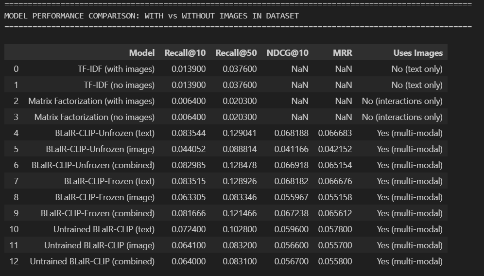
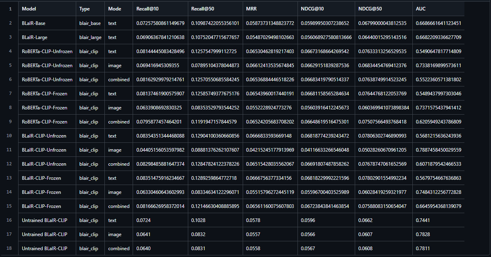

# 🌟 **Multi-Modal Next-Item Recommendation using BLAIR-MM (Text + Image Embeddings)**


**Team Members:** _Will L., Derek P., Abdulaziz K., Mustafa H._  
**Instructor:** _Julian McAuley_

---

# 🚀 **Project Overview**

This project explores a **next-item recommendation** task using a **multi-modal embedding model** that combines domain-specific text representations with visual features.

We extend the BLAIR (Bridging Language and Items for Retrieval) framework by incorporating **image embeddings** through the **CLIP vision encoder**, creating a multimodal item representation we call ****BLaIR-CLIP**.

Our Motivating Question:

> **Does incorporating visual information (product images) improve product search and recommendation performance compared to text-only methods?**

An in-depth showcase of the model definition and evaluation can be found in our Jupyter [notebook](model_showcase.ipynb).
---

# 📚 **1. Predictive Task Definition**

### 🎯 Task

Predict the next item a user will interact with, given their chronological interaction sequence. We treat this as a ranking task: given a user history, the model must rank the ground-truth "next item" higher than all other candidate products in the catalog.

### 📈 Evaluation Metrics

-   _**Recall@10 / Recall@50**_: Proportion of test cases where the correct item appears in the top-K results.
-   _**NDCG@10**_: Normalized Discounted Cumulative Gain to measure ranking quality.
-   _**MRR**_: Mean Reciprocal Rank of the first relevant item.
-   _**AUC**_: Area Under the ROC Curve to evaluate separation of positives and negatives.

### 🧪 Baselines

We compare our multimodal approach against traditional methods, testing each under two conditions to isolate the impact of visual data:

1. _**TF-IDF + Cosine Similarity**_ (With and Without images in the dataset)
2. _**Matrix Factorization (MF)**_ (With and Without images in the dataset).
3. _**BLaIR-CLIP Fusion**_: Our proposed dual-encoder model combining BLaIR (RoBERTa) and CLIP (ViT).

---

# 🔍 **2. Dataset, EDA, and Preprocessing**

### 📦 Dataset

We use the Amazon Reviews 2023 dataset, specifically focusing on the Appliances category:

-   _**Metadata**_: 94,327 products containing titles, descriptions, feature lists, and image links
-   _**Reviews**_: 2,128,605 user interactions.
-   _**Average Rating**_: 4.22/5.0.

### 🧹 Preprocessing

-   _**Text Unification**: Combined product title, description, and bulleted features into a single string._
-   _**User Filtering**: Removed users with fewer than two interactions to allow for training and testing._
-   _**Temporal Splitting**: Employed a Leave-One-Out strategy—the final interaction for each user is held out for testing._
-   _**Image Regularization**: Images resized to 224x224 and normalized for the CLIP processor._

---

# 🧠 **3. Modeling**

## 🏗 **Model Architecture — BLAIR-MM**
The model is based on a **Dual Encoder** architecture, consisting of two separate neural networks:
1.  One for processing text
2.  One for processing images

These two towers encode their respective modalities into vectors in the same shared latent space. In this space, the goal is for matching text-image pairs to be close together, and mismatched pairs to be far apart.

### **Text Encoder — BLAIR**

-   _Base: RoBERTa-based transformer._
-   _Output: 768-dimensional CLS embedding._

### **Image Encoder — CLIP**

-   _Base: OpenAI’s Contrastive Language-Image Pre-training (CLIP) ViT-B/32._
-   _Output: 512-dimensional image embedding._

### **Fusion Module**

-   _Projections: Linear layers map both text and image vectors into a shared 512-dimensional space._
-   _Fusion: Normalized dot-product similarity is used to combine the two networks._

For details on how to run the BLAIR + CLIP model, the details are found [here](./blair/README.md).

---

# 📊 **4. Evaluation**

### Evaluation Protocol
The evaluation methodology is as follows.
For each user in the test set, the following are taken:
- Their single held-out positive item
- And all other items in the catalog as negatives

The model is then asked to produce a ranking. The metrics computed are:
- **Recall@10**: Whether the correct item appears in the top 10.
- **Recall@50**: Looking slightly deeper.
- **AUC**: Which evaluates how well the model separates the positive item from the negatives.

This evaluation setup is rigorous because the model is competing against thousands of possible negative items.  
The following snippet comes from the ranking loop. It shows that predicted scores are taken, items the user has already interacted with are masked out, and then the rank of the single positive item is computed. This rank determines the Recall and AUC metrics. The important part is that this evaluation code is shared across all baselines, ensuring a fair comparison.

```python
# Source: baseline_utils.py
for i, (user_id, gt_item) in enumerate(test_data):
    gt_index = self.asin_to_index[gt_item]
    
    scores = score_func(user_id) # Should return (N_items,)
    
    # Mask training items
    train_items = self.train_interactions[user_id]
    train_indices = [self.asin_to_index[a] for a in train_items if a in self.asin_to_index]
    
    scores[train_indices] = -np.inf
    scores[gt_index] = gt_score # Restore GT score
    
    # Rank
    higher_scores = (scores > gt_score).sum()
    rank = higher_scores + 1
```

### Results
Our experiments show that neural multimodal embeddings peform better than the classical text-based models and collaborative methods on the Appliances dataset:





### Key Findings

- Neural Dominance: The BLaIR-CLIP model outperformed TF-IDF by approximately 6x in Recall@10.
- Image Impact: Visual features help disambiguate products where text descriptions are vague or generic.
- Sparsity Handling: While Matrix Factorization struggled with the high sparsity of the interaction matrix (AUC ~0.48), the content-based BLaIR-CLIP model remained robust (AUC ~0.71+)

---

# 📚 **5. Related Work**

### Classical Recommender Models

-   _Matrix Factorization_
-   _Bayesian Personalized Ranking (BPR)_
-   _First-order sequence models (last-item transitions)_

### Text-based Retrieval Methods

-   _TF-IDF retrieval_
-   _item2vec (Skip-Gram)_
-   _Transformer text encoders_

### Multi-Modal Recommendation

-   _VBPR_
-   _DeepStyle_
-   _CLIP-based retrieval_
-   **_BLAIR (text-only embedding model)_**

### Our Contribution

-   _First multimodal extension of BLAIR using CLIP_
-   _Fusion of text + image for item representations_
-   _Sequential evaluation via next-item prediction_

---

# 📁 **Project Structure Highlights**

```
project/
│
├── README.md
├── model_showcase.html                # notebook detailing the modeling process
├── baseline_utils.py                  # utility file for splitting data and evaluating baseline models
│
├── baselines/
│   ├── baseline_mf.py                 # MF model class definition
│   ├── baseline_tfidf.py              # TF-IDF model class definition
│   ├── run_baselines.py               # trains and evaluates the baseline models with and without images
│  
├── encoders/
│   ├── clip_encoder.py                # encoder used for CLIP model
│
├── blair/
│   ├── multimodal/ 
│   ├── blair_clip.py                  # BLAIR-MM class definition
│   ├── sample_multimodal_data.py      # preprocess dataset for MM model
```

---

# 🎉 **Conclusion**

BLAIR-MM produces **multimodal item embeddings** by combining text (BLAIR) and image (CLIP) signals.  
When integrated into MF, these embeddings significantly outperform classical baselines in next-item recommendation, especially under cold-start conditions.
